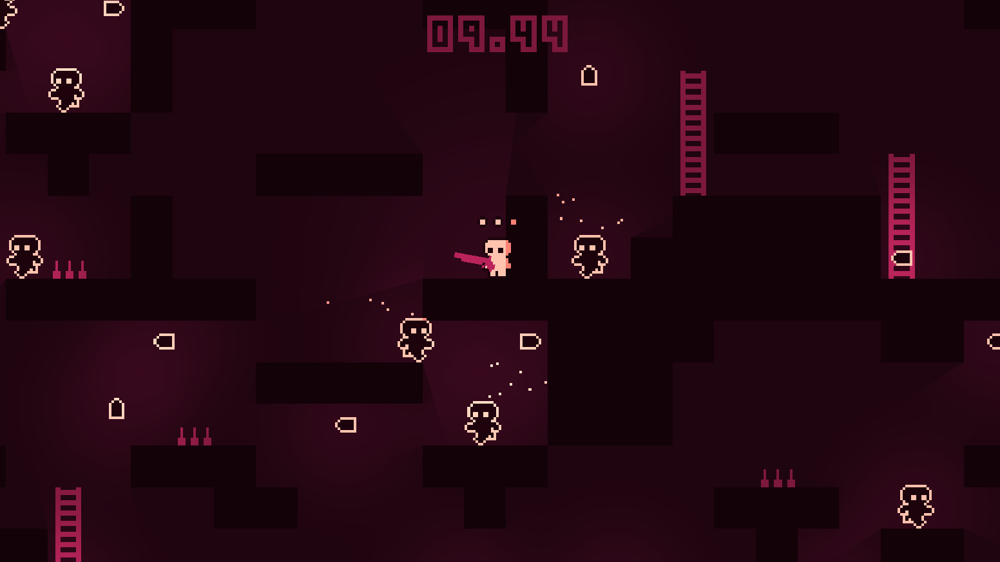

# Hellish Descent

Descend into the darkest depths of hell in this small platformer game.  
Move using `W`, `A`, `S`, `D` or the arrow keys.  
Aim and shoot using the mouse.  
Your weapon changes every 10 seconds.

Levels are randomly generated.

---

Made in [Godot](https://godotengine.org) 4.0 beta 2 for Ludum Dare 51 (48 hours).  
The game can be played here: https://ldjam.com/events/ludum-dare/51/hellish-descent  
The source code can be found here: https://github.com/95jonpet/ld51